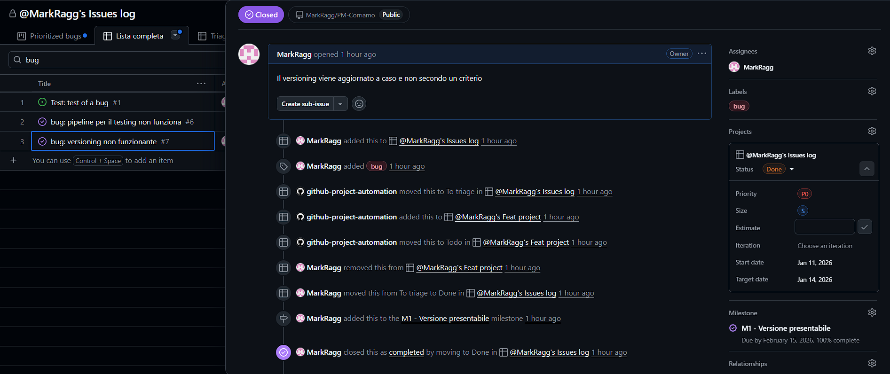

# Monitoring and controlling
Durante questa fase, il progetto è già entrato nella fase di sviluppo. Vengono formalizzati i tools che verranno usati per monitorare e controllare il corretto sviluppo. Il monitoraggio è cruciale per poter agire tempestivamente in caso di criticità ed avere ogni attività registrata.

## Reporting
Per la parte di reporting è stato deciso di utilizzare le varie feature presenti su **GitHub**. 

## Scope bank
Al fine di avere una riserva di tempo per eventuali modifiche di scope o ritardi nello sviluppo è stata costituita una Scope bank. Il tempo inserito all'interno della scope bank è il 10% del tempo/uomo totale, questo perchè si stima che ci saranno alcuni cambiamenti di scope importanti durante lo sviluppo.

Le regole per aggiungere o togliere tempo alla Scope bank sono:
- Se un'attività viene completata prima del tempo richiesto, il tempo rimanente viene depositato.
- Se un'attività viene eliminata, il tempo deve essere aggiunto alla Scope bank.
- Si può attingere al deposito in caso di cambiamento di scope, con cautela e senza andare mai in negativo.

## Mantenere l'Issue log
Per tenere traccia dei problemi presenti o passati del progetto viene creato l'Issue log. In questo caso viene utilizzato **GitHub** tramite l'utilizzo coordinato di _Issue + Project_, che permette la creazione di issue e il tracciamento attraverso grafici e liste, contententi filtri e possibilità di personalizzazione per facilitarne l'uso.

GitHub fornisce le seguenti feature per il tracciamento degli issue:

- **ID**: identificatore univoco
- **Data creazione**: la data in cui viene creato l'issue
- **Titolo**: abbreviazione del problema
- **Descrizione**: descrizione più dettagliata del problema
- **Descrizione dell'impatto**: è possibile inserire nella descrizione anche l'analisi dell'impatto
- **Definizione Owner**: Viene definito il creatore dell'issue e può anche essere assegnato ad un altro sviluppatore
- **Tag**: è possibile creare dei tag per rappresentare meglio il problema (es. bug, hotfix), essendo i tag personalizzabili è possibile utilizzarli anche per la gestione delle priorità.
- **Stato**: gli stati standard presenti su GitHub sono _To triage, Backlog, Ready, In progress, Done_. Anche in questo caso è possibile personalizzarli
- **Milestone**: è possibile assegnare l'issue ad una determinata milestone, in modo da comprendere quale fase dello sviluppo inpatta questo problema

L'issue log rimane accessibile a tutti i membri del team ed attraverso le tabelle che possono essere create, risulta facile ordinare gli issues in base alle proprie esigenze (es. capirne il proprietario, ordinare in base alla milestones, ordinare in base al tag/priorità/stato).

**Legenda**: Esempio di issue log + visualizzazione issue specifico 

## Project Status Meeting
I meeting relativi al progetto sono già stati definiti nel capitolo [3-launching-execution.](./3-launching-execution.md), come ad esempio il Daily standup meeting o l'Help meeting.