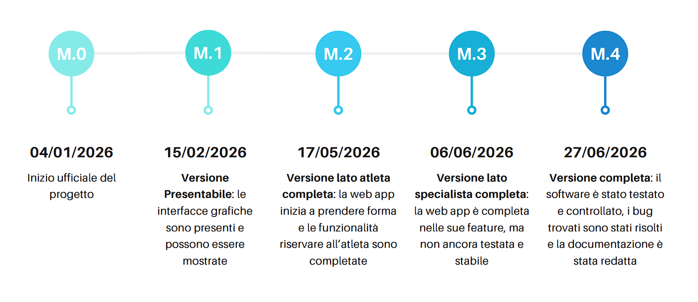

# Gantt
Il diagramma di Gantt è stato realizzato a partire dal Project Network Diagram
precedentemente definito durante la fase di pianificazione.

Il PND ha permesso di individuare le attività del progetto e le loro dipendenze
logiche. Sulla base di queste informazioni, e delle stime
temporali ottenute tramite la tecnica del Planning Poker, è stato possibile
costruire il diagramma di Gantt, che rappresenta in modo chiaro e sintetico
la pianificazione temporale del progetto. Attraverso il Gantt è stato possibile inoltre visualizzare i percorsi critici, che potrebbero portare a futuri rallentamenti.

Per la creazione del Gantt è stato utilizzanto **Monday**, un sito per la pianificazione del lavoro e del workflow, presenta vari tool utili per la creazione del Gantt. Il sito infatti permette una buona visualizzazione del diagramma ed una creazione agevolata, con tutte le informazioni che potrebbero servire. Inotre, dato un diagramma, permette di individuare i percorsi critici (i task evidenziati come rossi).

Essendo un pdf si consiglia la visualizzazione tramite apposito reader. 

[FILE Gantt](./Gantt.pdf)

Sul sito sono presenti anche le dipendenze tra le varie attività che, nel formato pdf, non vengono visualizzati.

Tramite il Gantt, sono state individuate delle possibili date per la realizzazione delle varie milestones.

